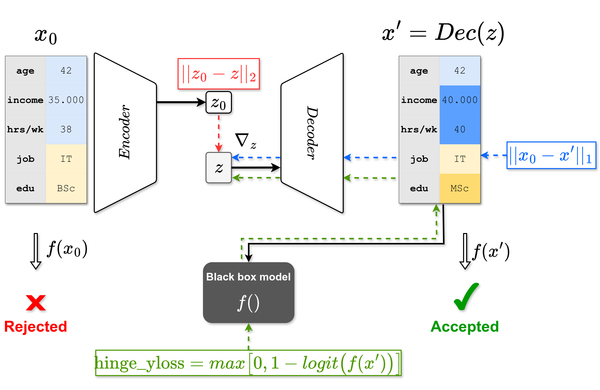

# TABCF: Counterfactual Explanations for Tabular Data Using a Transformer-Based VAE

*This paper has been presented at the 5th ACM International Conference on AI in Finance (ICAIF '24), November 14-17, 2024, Brooklyn, NY, USA.*
*For a detailed explanation, you can read our full paper here: [TABCF Paper](https://dl.acm.org/doi/10.1145/3677052.3698673).*


<div align="center">
  
</div>

Abstract: 

In the field of Explainable AI (XAI), counterfactual (CF) explanations are one prominent method to interpret a black-box model by suggesting changes to the input that would alter a prediction. In real-world applications, the input is predominantly in tabular form and comprised of mixed data types and complex feature interdependencies. These unique data characteristics are difficult to model, and we empirically show that they lead to bias towards specific feature types when generating CFs. To overcome this issue, we introduce TABCF, a CF explanation method that leverages a transformer-based Variational Autoencoder (VAE) tailored for modeling tabular data. Our approach uses transformers to learn a continuous latent space and a novel Gumbel-Softmax detokenizer that enables precise categorical reconstruction while preserving end-to-end differentiability. Extensive quantitative evaluation on five financial datasets demonstrates that TABCF does not exhibit bias toward specific feature types, and outperforms existing methods in producing effective CFs that align with common CF desiderata. 


## Setup

Create a conda environment
```
conda create -n tabcf python=3.10
conda activate tabcf
```
Install dependencies 
```
pip install -r requirements.txt
```
Download and process datasets
```
python download_dataset.py
python process_dataset.py
```

Install local DiCE optimization framework and local CARLA framework 
```
cd baselines/dice/DiCE-main
pip install -e .
```

```
cd baselines/CARLA
pip install -e .
```


Train VAE model
```
python main.py --dataname [NAME_OF_DATASET] --method vae --mode train
```

## Usage

To generate counterfactuals with TABCF run the following command:
```
python main.py --dataname [NAME_OF_DATASET] --method tabcf --mode sample --num_samples [NUMBER_OF_SAMPLES]
```

The same command can be used to generate counterfactuals using a competitor method, e.g.:
```
python main.py --dataname [NAME_OF_DATASET] --method wachter --mode sample --num_samples [NUMBER_OF_SAMPLES]
```

The resulting counterfactuals are saved as `.csv` files  under the directory `/counterfactual_results`.

For calculation of all metrics (evaluation), given the generated csv files, run the following command:

```
python main.py --dataname [NAME_OF_DATASET] --method wachter --mode evaluate --num_samples [NUMBER_OF_SAMPLES]
```

## General code structure

* [/baselines](./baselines/) contains all baseline methods used in our experiments. Each folder contains a `sample.py` file which finds and saves counterfactuals.
* [/utils.py](./utils.py) contains all hyperparameter definitions.
* [/evaluation_framework/evaluate.py](./evaluation_framework/evaluate.py) is used to calculate all metrics, given saved counterfactuals.
* [/data/Info](./data/Info) contains all necessary information for each dataset.
* [/download_dataset.py](./download_dataset.py) download the datasets from the provided information.
* [/process_dataset.py](./process_dataset.py) pre-processes the datasets.
* [/lamda_loss_plot_all.py](./lamda_loss_plot_all.py) runs the ablation study experiment.
* [/feature_usage_plot.py](./feature_usage_plot.py) runs the feature-usage experiment.
* [/shapley.py](./shapley.py) runs the shapley-values experiment.


## Acknowledgments

In our code we use and alter versions of the following repositories.

* [TABSYN](https://github.com/amazon-science/tabsyn) (VAE structure)
* [DiCE](https://github.com/interpretml/DiCE) (under `/baselines/dice/DiCE-main`), SGD optimization for counterfactual generation.
* [CARLA](https://github.com/carla-recourse/CARLA) (under `/baselines`), the CARLA framework is used for evaluation against baseline methods.

